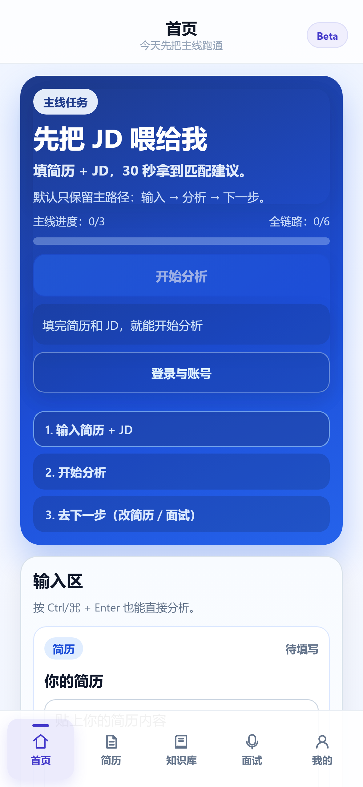
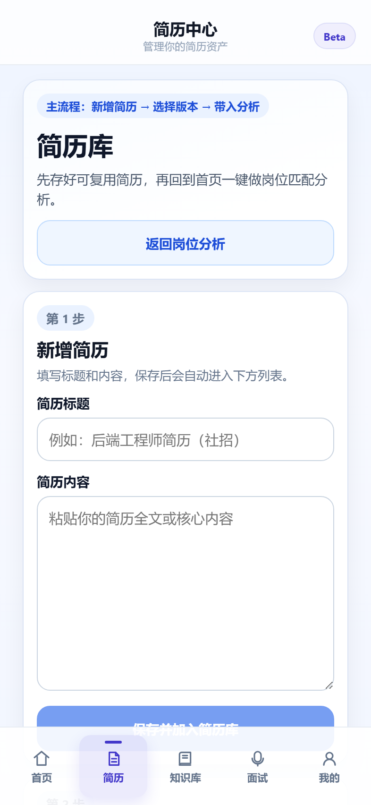
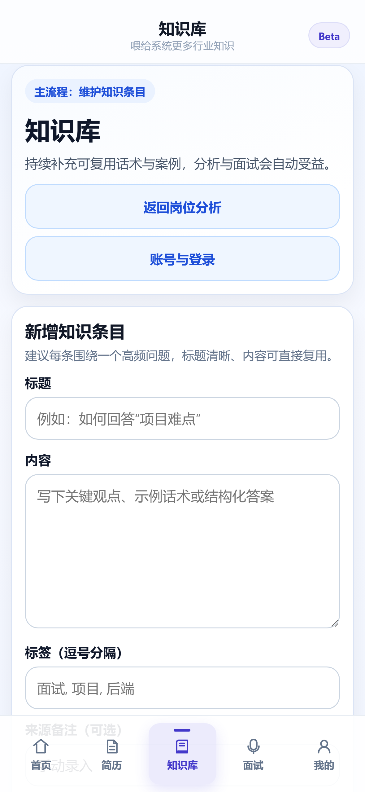
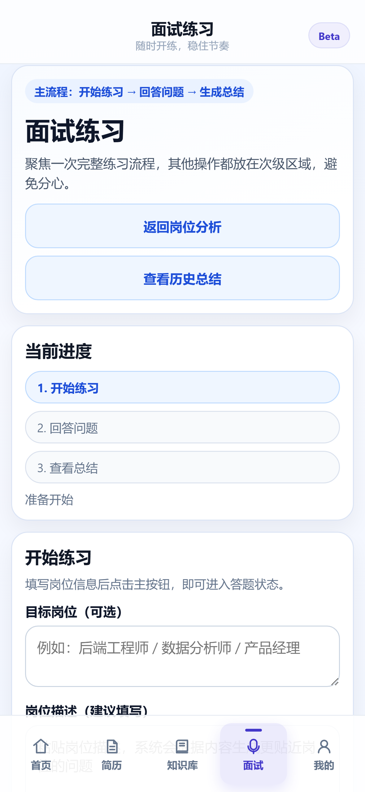
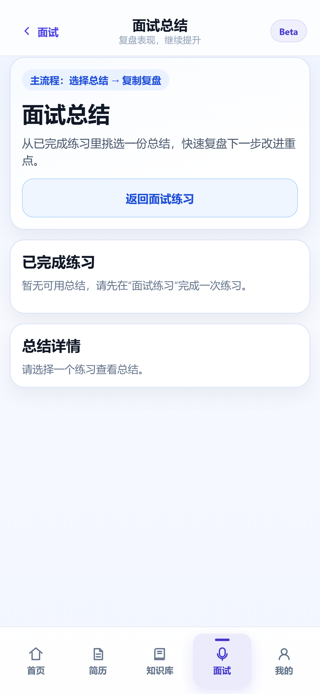
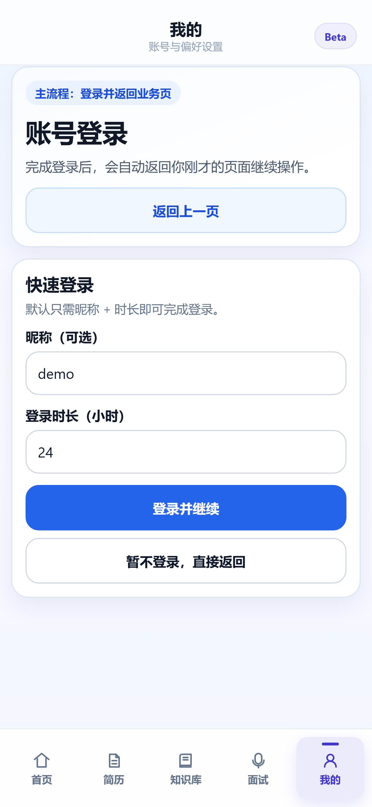

# Career Hero MVP (Next.js + FastAPI)

按大boss要求：
- 不复用旧项目资产
- 前端：Next.js
- 后端：FastAPI

## 最新移动端截图（Wave14）

> 截图目录：`docs/screenshots/wave14-no-indicator/`








---

## 1) 项目结构

- `frontend/`：Next.js 前端（输入简历/JD、展示分析结果、查看历史、导出）
- `backend/`：FastAPI 后端（分析接口、历史落库、导出、指标）
- `sprint-progress.md`：迭代进展记录
- `docs/`：交付文档（上线检查、回滚预案等）

---

## 2) MVP 闭环

1. 输入简历文本
2. 输入 JD 文本
3. 点击分析
4. 返回：
   - 匹配分
   - 匹配关键词
   - 缺失关键词
   - 优化建议
   - 优化版简历
   - 评分拆解（`scoreBreakdown`）
   - 洞察（`insights`）
5. 自动写入历史记录，可按 requestId 检索并导出（TXT/JSON/PDF）

---

## 3) 从零启动（推荐流程）

### 3.1 环境要求

- Python 3.11+
- Node.js 20+
- npm 10+

### 3.2 启动后端（独立 venv）

```bash
cd backend
python -m venv .venv
```

激活虚拟环境：

- Windows PowerShell

```bash
.\.venv\Scripts\Activate.ps1
```

- macOS / Linux

```bash
source .venv/bin/activate
```

安装依赖并启动：

```bash
pip install -r requirements.txt
uvicorn app.main:app --reload --port 8000
```

### 3.3 启动前端

```bash
cd frontend
npm install
npm run dev
```

默认地址：
- 前端：`http://127.0.0.1:3000`
- 后端：`http://127.0.0.1:8000`

---

## 4) 环境变量

### 4.1 Frontend（`frontend/.env.local`）

```bash
NEXT_PUBLIC_API_BASE_URL=http://127.0.0.1:8000
```

> 不配置时默认值就是 `http://127.0.0.1:8000`。

### 4.2 Backend（可放在系统环境变量或启动命令前注入）

| 变量名 | 默认值 | 说明 |
|---|---:|---|
| `CAREER_HERO_AI_PROVIDER` | `rule` | 分析模式：`rule` / `gemini` / `auto` |
| `GEMINI_API_KEY` | 空 | 使用 Gemini 时必填 |
| `GEMINI_MODEL` | `gemini-1.5-flash` | Gemini 模型名 |
| `CAREER_HERO_DB_PATH` | `backend/data/career_hero.sqlite3` | SQLite 数据文件路径 |
| `CAREER_HERO_HISTORY_RETENTION` | `500` | 每次分析后保留的最大历史条数 |
| `CAREER_HERO_MAX_JSON_BYTES` | `80000` | `/api/analyze` 请求体上限（字节） |
| `CAREER_HERO_RATE_LIMIT_PER_MINUTE` | `20` | 单 session 每分钟请求上限 |
| `CAREER_HERO_DUPLICATE_LIMIT` | `3` | 单 session 重复提交限制 |

Windows PowerShell 示例：

```powershell
$env:CAREER_HERO_AI_PROVIDER="auto"
$env:GEMINI_API_KEY="<your-key>"
$env:GEMINI_MODEL="gemini-1.5-flash"
uvicorn app.main:app --reload --port 8000
```

---

## 5) API 概览

- `GET /health`
- `POST /api/analyze`
- `GET /api/history?limit=20&requestId=...`
- `GET /api/history/{historyId}`
- `POST /api/history/cleanup`
- `GET /api/history/{historyId}/export?format=txt|json|pdf`
- `GET /api/metrics/snapshot`

`POST /api/analyze` 请求示例：

```json
{
  "resumeText": "...",
  "jdText": "..."
}
```

统一错误返回格式（常见：400/413/422/429/500）：

```json
{
  "code": "VALIDATION_ERROR",
  "message": "Value error, text cannot be blank",
  "requestId": "2d2c2bd8-28b0-454d-a82c-2a7d76aaf11d"
}
```

---

## 6) 常见故障（Troubleshooting）

### 6.1 前端报错：`Failed to fetch` / 请求不到后端

- 确认后端已启动：`http://127.0.0.1:8000/health`
- 检查 `NEXT_PUBLIC_API_BASE_URL` 是否配置正确
- 修改 `.env.local` 后需重启前端开发服务器

### 6.2 端口冲突（3000 / 8000）

- 更换端口启动：
  - 后端：`uvicorn app.main:app --reload --port 8010`
  - 前端：`npm run dev -- -p 3001`
- 若改端口，记得同步更新 `NEXT_PUBLIC_API_BASE_URL`

### 6.3 PowerShell 无法激活虚拟环境

可先放开当前用户执行策略：

```powershell
Set-ExecutionPolicy -ExecutionPolicy RemoteSigned -Scope CurrentUser
```

然后重新执行：

```powershell
.\.venv\Scripts\Activate.ps1
```

### 6.4 `/api/analyze` 返回 413（`PAYLOAD_TOO_LARGE`）

- 减少输入文本大小
- 或提高后端限制：`CAREER_HERO_MAX_JSON_BYTES`

### 6.5 使用 Gemini 但仍显示 `analysisSource=rule`

- 检查 `GEMINI_API_KEY` 是否已设置
- `CAREER_HERO_AI_PROVIDER` 是否为 `gemini` 或 `auto`
- 若 Gemini 调用失败，系统会自动 fallback 到 `rule` 并返回 `fallbackUsed=true`

### 6.6 导出 PDF 失败

- 确认后端依赖安装完整：`pip install -r requirements.txt`
- `reportlab` 缺失会导致 PDF 导出不可用

---

## 7) 验收步骤（建议按顺序）

### 7.1 自动化检查

#### Backend

```bash
cd backend
.\.venv\Scripts\python -m pytest -q
```

#### Frontend

```bash
cd frontend
npm run build
```

### 7.2 接口验收（手动）

1. `GET /health` 返回 `{"status":"ok"}`
2. 调用 `POST /api/analyze` 成功返回：
   - `score`、`scoreBreakdown`、`insights`
   - `historyId`、`requestId`
3. `GET /api/history` 可看到最新记录
4. `GET /api/history/{historyId}` 可查看详情
5. `GET /api/history/{historyId}/export?format=txt|json|pdf` 三种格式可下载

### 7.3 前端验收（手动）

1. 输入简历 + JD，点击“开始分析”
2. 验证 loading / error / empty 状态正常
3. 分析成功后：
   - 结果区展示 score、scoreBreakdown、insights、关键词、优化建议
   - 历史区自动刷新并可展开详情
4. 验证“复制结果”与导出按钮（TXT/JSON/PDF）
5. 验证历史检索（按 requestId）与清理功能（保留 N 条、清空全部）

---

## 8) 相关文档

- `docs/release-checklist.md`：上线前检查清单
- `docs/rollback-runbook.md`：回滚与应急操作手册
- `sprint-progress.md`：研发推进与日更模板
